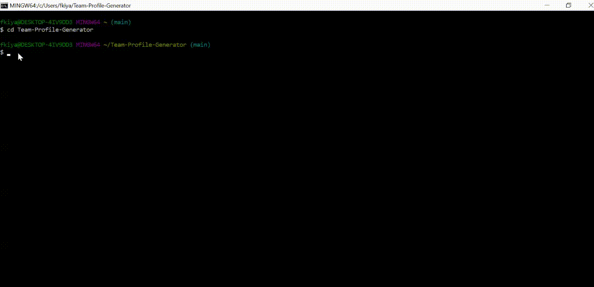

# Team-Profile-Generator

## Description
This repository consists of a Node.js command-line application that takes in information about employees on a software engineering team, then generates an HTML webpage that displays summaries for each person. The application is a homework assignment from the Case Western Reserve University’s Coding Bootcamp. 

## Table of Contents
    
* [Installation](#installation)
    
* [Usage](#usage)
    
* [Contributions](#contributions)
    
* [License](#license)
    
## Walkthrough Video

## Installation
npm init. npm install inquirer.

## Usage
Run in command line. You will need to answer the prompted questions which will create the team member profile.

## Contributions
None

## License
None